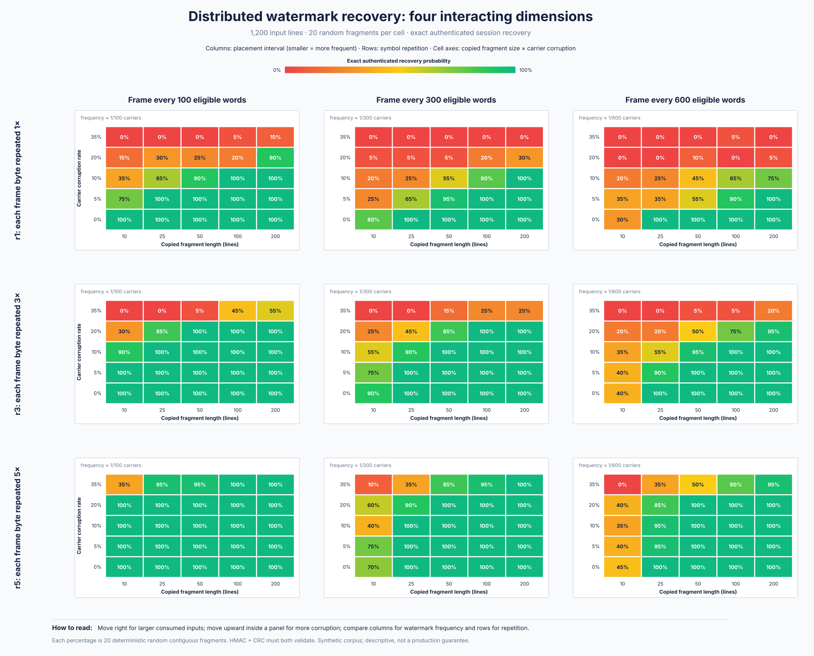
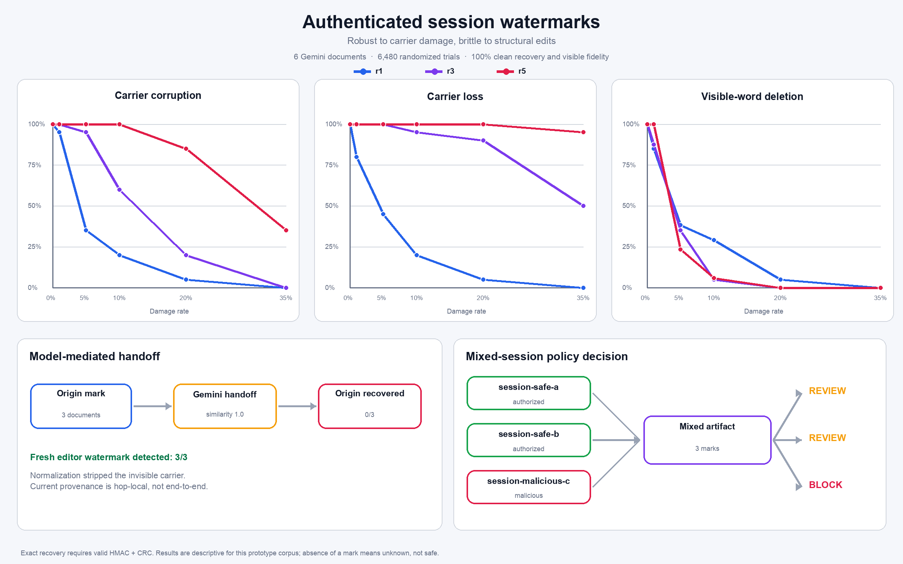

# XRF Agent Provenance

An experimental Python prototype for attaching authenticated session provenance to AI-agent prose, recovering it from copied fragments, and tracking exact changes to code without modifying the code itself.

> **Prototype, not a security boundary.** A valid mark is evidence that a cooperating issuer marked some content. It does not prove that the content is safe or malicious. An absent mark means **unknown**, not safe.



## The idea

When one agent's output becomes another agent's input, a gateway can inspect it before it reaches the destination model. XRF explores whether authenticated, session-derived marks can provide one additional provenance signal at that boundary.

```text
agent output
    │
    ▼
provenance encoder ── distributed authenticated frames
    │
    ▼
files, messages, or tool results
    │
    ▼
destination gateway ── detector ── session registry ── policy event
    │                                      │
    └──────────────────────────────────────┴── allow / review / quarantine / block
```

The raw session ID and secret are never embedded. The prototype derives an opaque tag with HMAC and encodes this frame:

```text
XRF | version | tag length | HMAC-derived session tag | CRC32
```

The current in-band carrier uses Unicode variation selectors after eligible prose words. Code blocks, commands, URLs, quantities, likely named entities, acronyms, and negation terms are excluded.

## Why the frame is distributed

A mark only at the beginning disappears when someone copies a later subsection. `embed_distributed_watermark` instead places complete, independently decodable frames throughout long prose. In the included 1,200-line run, a frame starts every 300 eligible words, producing approximately 105 recovery opportunities.

```text
[complete frame + prose] … [complete frame + prose] … [complete frame + prose]
          └──────── any sufficiently large copied subsection ────────┘
```

Frame-byte repetition and frame distribution solve different problems:

- **Symbol repetition (`r1`, `r3`, `r5`)** repairs local carrier loss or corruption.
- **Distributed frames** let a copied subsection decode independently of the document beginning.

## What the experiments show

Three checked-in, reproducible studies contain raw CSV/JSON data, reports, and figures.

### Frequency × repetition × corruption study

The main figure crosses four variables simultaneously across 4,500 deterministic trials:

- **X-axis:** copied fragment length in lines—the amount consumed by another agent.
- **Y-axis:** variation-selector corruption rate.
- **Panel columns:** complete-frame interval; 100 words is three times more frequent than 300 words and six times more frequent than 600 words.
- **Panel rows:** per-byte repetition level (`r1`, `r3`, or `r5`).
- **Cell color and label:** exact authenticated recovery probability; both HMAC-derived tag and CRC must validate.

The result makes the trade-off visible. Frequent placement mainly helps short copied fragments; repetition mainly helps damaged carrier symbols. At 10 clean lines, `r1` recovery fell from 100% with a 100-word interval to 30% with a 600-word interval. At 50 lines and 20% corruption, `r3` recovered 100%, 85%, and 50% at 100-, 300-, and 600-word intervals. With `r5`, 200-line fragments retained 95–100% recovery even at 35% corruption across all tested intervals.

- [Study explanation](frequency_studies/frequency-study-20260906-215314/REPORT.md)
- [All 225 aggregate cells](frequency_studies/frequency-study-20260906-215314/frequency-results.csv)
- [Run metadata](frequency_studies/frequency-study-20260906-215314/summary.json)

### Distributed-fragment study

The deterministic study used 1,200 lines, approximately 31,690 eligible words, 105 frames, 30 trials per cell, and 720 random fragment trials. Each mutation round dropped 5% and corrupted 5% of carrier symbols.

| Random fragment | Clean | After 1 round | After 2 rounds | After 3 rounds |
|---:|---:|---:|---:|---:|
| 5 lines | 30.0% | 26.7% | 16.7% | 10.0% |
| 10 lines | 76.7% | 73.3% | 50.0% | 20.0% |
| 25 lines | 100% | 96.7% | 73.3% | 36.7% |
| 50 lines | 100% | 100% | 100% | 70.0% |
| 100 lines | 100% | 100% | 100% | 90.0% |
| 200 lines | 100% | 100% | 100% | 100% |

Small fragments sometimes contain no complete frame. With this corpus and placement interval, 25 clean lines was the smallest tested size reaching at least 90% exact recovery.

- [Study report](fragment_studies/fragment-study-20260906-120335/REPORT.md)
- [Aggregate data](fragment_studies/fragment-study-20260906-120335/fragment-aggregate.csv)
- [All 720 trials](fragment_studies/fragment-study-20260906-120335/fragment-trials.csv)

### Long-form and model-handoff study



This run used six Gemini-generated documents and 6,480 randomized perturbation trials. Clean exact recovery and visible-text fidelity were both 100%. Fivefold repetition was strong against carrier-symbol damage, but visible-word deletion caused synchronization failure.

All three model-mediated handoffs removed the original invisible carrier even though visible similarity was 1.0 in those calls. A new editor mark applied after the handoff decoded in all three cases. That result supports **hop-local provenance**, not durable end-to-end tracking through arbitrary model transformations.

- [Detailed report](research_runs/xrf-study-20260906-104444/REPORT.md)
- [Aggregate curves](research_runs/xrf-study-20260906-104444/aggregate-results.csv)
- [All 6,480 trials](research_runs/xrf-study-20260906-104444/trial-results.csv)
- [Model handoffs](research_runs/xrf-study-20260906-104444/rewrite-results.json)

## Code provenance

The prototype does **not** insert invisible characters into source code. `watermark_lab/code_provenance.py` creates a detached, authenticated manifest containing:

- an opaque session tag;
- the exact content SHA-256;
- per-chunk hashes; and
- a manifest HMAC.

This preserves the code byte-for-byte while identifying changed chunks. In the included 1,200-line code experiment, a one-line edit invalidated exactly one of 24 chunks; changes across a chunk boundary invalidated exactly two.

The manifest detects change and provenance. It does not determine whether code is malicious; that still requires sandboxing, static analysis, command policy, scoped credentials, and runtime monitoring.

## Quick start

Requirements: Python 3.10 or later. Core encoding and detection use only the standard library. The visualization scripts require Pillow.

```bash
python -m pip install -e '.[research]'
python -m unittest discover -s tests -v
```

Add a single frame:

```bash
export WATERMARK_SECRET='replace-with-at-least-16-random-characters'
python scripts/add_watermark.py --session-id session-a --redundancy 3 \
  < input.txt > marked.txt
```

Detect it and consult the example registry:

```bash
python scripts/detect_watermark.py \
  --registry examples/registry.json \
  --destination-session destination-agent \
  --redundancy 3 < marked.txt
```

Reproduce the offline distributed-fragment study:

```bash
python scripts/run_fragment_study.py
```

Run the smaller carrier benchmark:

```bash
python scripts/benchmark.py --redundancy 3
```

The Gemini studies are optional. Put `GOOGLE_API_KEY=...` in the ignored `secret.env`, then run:

```bash
python scripts/run_gemini_simulations.py --model gemini-3.5-flash-lite
python scripts/run_research_study.py --model gemini-3.5-flash-lite
```

API keys are never reused as watermark keys or written to result bundles.

## Repository map

```text
watermark_lab/
  core.py                 frame, carriers, single/distributed encoder, detector
  code_provenance.py      detached authenticated code manifests
  registry.py             session lookup and example policy decisions
  attacks.py              synthetic transformations
  reporting.py            fidelity and result helpers
scripts/
  add_watermark.py        command-line encoder
  detect_watermark.py     command-line detector and registry lookup
  benchmark.py            compact offline benchmark
  run_fragment_study.py   long fragments, repeated damage, code manifests
  run_research_study.py   long-form and model-mediated experiments
tests/                     unit and study tests
fragment_studies/         selected reproducible fragment evidence
frequency_studies/        four-dimensional placement/recovery evidence
research_runs/            selected long-form evidence
```

## Security and privacy limitations

- Variation selectors are easy for a Unicode-aware adversary to locate and strip.
- Normalizers, editors, messaging systems, and models may remove the carrier accidentally.
- Word insertion or deletion can desynchronize the current repetition codec.
- A valid mark authenticates an issued tag, not the truth, safety, or intent of the text.
- Watermark-based session correlation can create privacy and tracking risks.
- CRC is for corruption detection; HMAC supplies authentication.
- A compromised encoder key permits forged tags until that key is rotated or revoked.
- Covert channels through code, filenames, timing, encryption, and tool behavior remain outside this carrier.

See [SECURITY.md](SECURITY.md) for reporting guidance. Production designs should prefer signed envelopes and transparency logs, using in-band marks only as a secondary recovery signal.

## Status and roadmap

This repository demonstrates a testable idea, not a production system or peer-reviewed result. Useful next experiments include independently synchronized shards, fountain or erasure coding, content-defined placement, larger unmarked corpora for false-positive measurement, multilingual text, copy/paste across common platforms, translation, paraphrase, and adaptive stripping attacks.

The companion long-form explanation is available as a [Medium-ready article draft](docs/medium-article.md).

## License

Licensed under the [Apache License 2.0](LICENSE). See [NOTICE](NOTICE).
